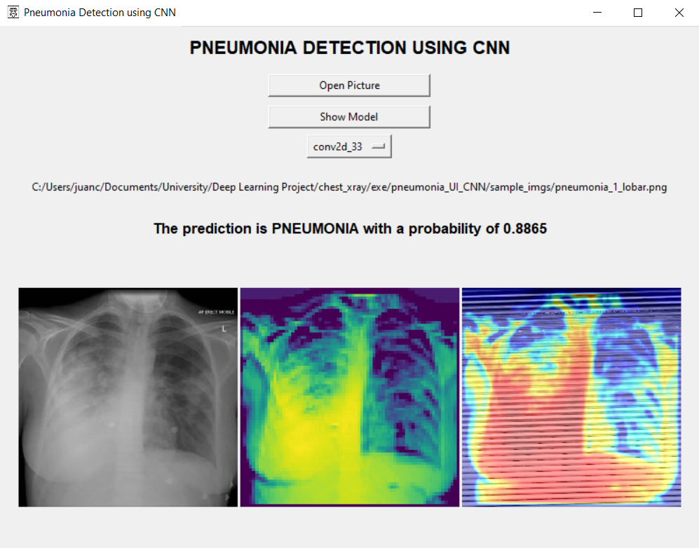

# Pneumonia Detection User Interface using CNN in Python
A simple user interface using tkinter with a pre-loaded CNN model estimated Tensorflow.

This interface was made to take any image, preprocess it and analyze it in a Convolutional Neural Network to finally return the prediction of pneumonia or not. Furthermore, it is possible to check the Gradient Class Activation Map for the image, not only in the last convolutional layer, but also in other layers of the network.

**`(!) ACADEMIC PURPOSE ONLY`**

